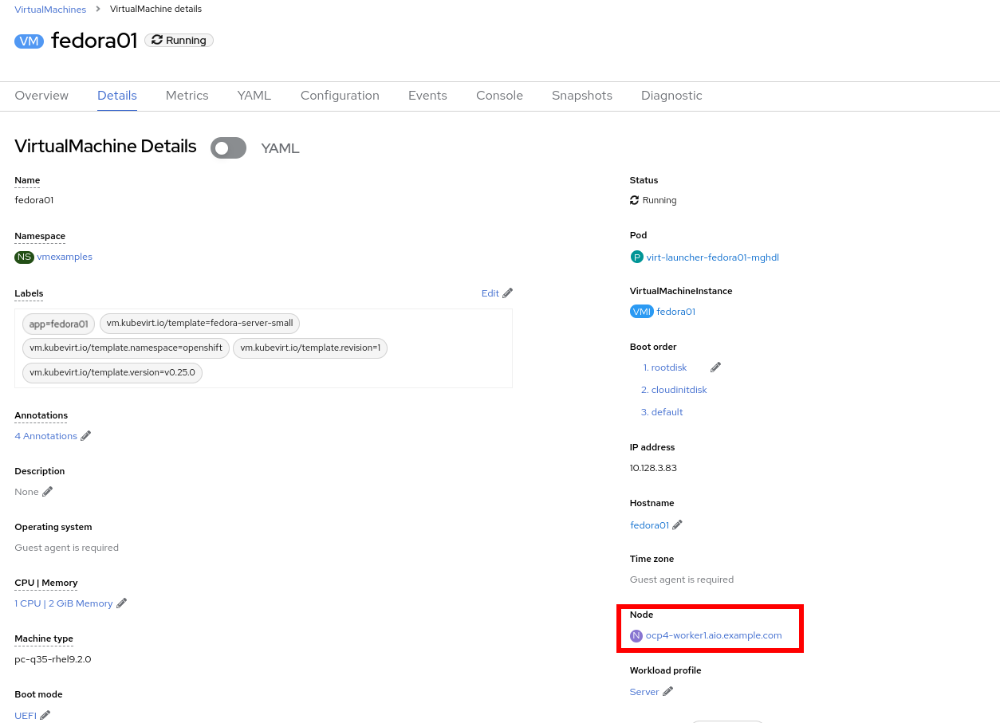
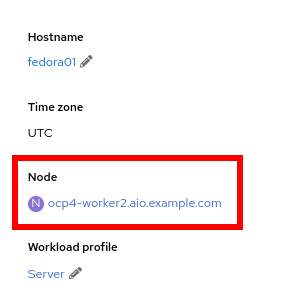
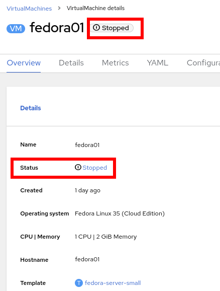
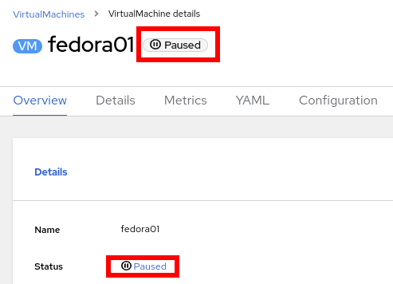

:scrollbar:
:toc2:
:numbered:

= OpenShift Virtualization の基礎

このラボでは、OpenShift Virtualization における VM の作成と管理の基本について紹介します。Web コンソールがプロセス全体を通してどのようにあなたをガイドするか、そして VM のプロパティを確認し、基本的なカスタマイズを行うことがいかに簡単であるかを確認します。その次のラボでは、VM をもう少しカスタマイズします。

このラボでは、VM をプロビジョニングするための 2 つの方法を紹介しますが、他にも様々な方法があり、ここで紹介する方法だけに限られるわけではありません。すべての VM プロビジョニング方法は、サポートされているすべてのゲスト OS で動作します。

VM 作成は、管理者にとって最も頻繁に実行するタスクの1つです。このセクションでは、事前に作成されたテンプレートを使用して新しい VM を作成するプロセスを説明します。管理者であれば、組織のカスタマイズ、好みの VM サイジングオプション、cloud-init または sysprep を使用した追加カスタマイズオプションを使用して、ゲスト OS ディスクを使用する独自のテンプレートを作成することができます。

.Goals
* 新しい VM を作成する
* VM コンソールにアクセスする
* VM コンソールの使用経験を積む

== 新しいプロジェクトの作成

OpenShift の他のオブジェクトと同様に、Kubnernetes の Namespace を抽象化した *Project* は、パーミッションやリソースを使用・管理するための境界となります。プロジェクトの作成はあらゆるワークロードをデプロイする際の重要な第一歩です。

. 左メニューの *Virtualization* -> *VirtualMachines* に移動します。
+
image::images/Create_VM_PVC/01_Left_Menu.png[Navigation Menu,136,266]
+
[NOTE]
====
*Virtualization* メニューは、OpenShift Virtualization がインストールされ、適切に設定されている場合に使用できます。
====

. 表示される *VirtualMachines* ダッシュボードを確認します。いくつかの VM がリストされていますが、いずれもパワーオンになっていません。
+
image::images/Create_VM_PVC/51_vm_list.png[]

. VM を作成する前に、新しいプロジェクトを作成します。一般的に VM は特定のプロジェクトにデプロイされ、そのプロジェクトへのアクセス権限を持たないユーザからは、VM にアクセス、管理、制御はできません。クラスタ管理者はすべてのプロジェクトにアクセスできるため、すべての VM を見ることができます。
+
.. *Project: All Projects* をクリックし、*Create Project* をクリックします。
+
image::images/Create_VM_PVC/50_create_new_project.png[]
.. *Name* フィールドに `vmexamples` と入力してプロジェクト名を付け、*Create* をクリックします。
+
image::images/Create_VM_PVC/03_Create_Project.png[]

== Linux 仮想マシンの作成
. *VirtualMachines* メニューから *Create VirtualMachine* をクリックします。
+
image::images/Create_VM_PVC/53_create_vm_button.png[]
. ウィザードが表示され、利用可能な定義済みの VM テンプレートが表示されます。
+
利用可能なテンプレートのリストを確認すると、"Source available" を示す青いバッジが付いているものがあることに気づくでしょう。これらは、自動的にダウンロードされ保存されたテンプレート・ディスクを使用しているテンプレートです。自分の環境にデプロイする場合、これらのソース・ディスクが作成されないようにしたり、削除したりするオプションがあります。
+
image::images/Create_VM_PVC/04_Create_VM_Templates.png[]
. *Fedora VM* をクリックすると、ダイアログが開きます。
+
image::images/Create_VM_PVC/05_Create_VM_Quick.png[]
. *VirtualMachine name* を `fedora01` に変更し、*Quick create VirtualMachine* をクリックします。
+
image::images/Create_VM_PVC/05_Create_VM_Quick_Name.png[]
+
. 数秒後、作成した VM が `Running` であることが確認できるでしょう。この間に、ストレージ・プロバイダは新しく作成された VM で使用できるよう、テンプレート・ディスクをクローンします。この作業にかかる時間は、ストレージ・プロバイダによって異なります。
+
image::images/Create_VM_PVC/06_Fedora_Running.png[]

. VM が作成されたら、作成のプロセスの詳細を確認するために *Events* タブを見てみましょう。もし VM の作成に問題があっても、このタブに表示されます。
+
image::images/Create_VM_PVC/09_Fedora_Events.png[]
+
* _DataVolume_ が作成されます。_DataVolume_ は VM ディスクの作成を管理するために使われ、VM 作成のフローにおいてクローンやインポートの処理を OpenShift の永続ストレージ上に抽象化しています。
* _VM_ が起動します。
. VMに関する情報を取得するには、*Details* タブをクリックします。このテンプレートでは、デフォルトで 1 CPU と 2GiB メモリであることを確認してみましょう。管理者は、VM のデフォルト構成をカスタマイズして新しいテンプレートを作成できます。
+
SDN (Software-defined Network) 上の VM の IP アドレスはここで表示されます。ブートオーダー、ワークロードプロファル、VM が稼働するノードなどの情報もここに表示されます。
+
image::images/Create_VM_PVC/10_Fedora_Details.png[]

== 仮想マシンコンソールへのアクセス

. VM のコンソールにアクセスするには、*Console* タブをクリックします。
+
image::images/Create_VM_PVC/13_Fedora_Console.png[]

. `fedora` ユーザ用に生成されたパスワードを見るには、*Guest login credentials* をクリックします。 これはテンプレートで cloud-init を使ってパスワードをカスタマイズする場合に表示されます。
+
image::images/Create_VM_PVC/14_Fedora_Console_Show_Password.png[]

. `fedora` ユーザーと表示されたパスワードを使用して VM にログインします。
+
[IMPORTANT]
パスワードをコピーした後、`Paste` をクリックして貼り付けることができます。
+
[IMPORTANT]
もし `Paste` 機能が動作しない場合は、コンソール入力が US キーマップを使用していることを確認してください。ちょっとしたコツとしては、ログイン時にパスワードを書き込んで、適切な文字（特に `-` 文字が正しいこと）を書き込んでいることを確認することです。

. ログインしたら、`ip a` コマンドを実行してインターフェースと IP アドレスを表示します。
+
image::images/Create_VM_PVC/15_Fedora_Network.png[]
+
このネットワークアダプタは SDN に接続されているので、割り当てられた IP アドレスは _KVM hypervisor_ によって使われる内部 IP アドレスであり、外部からアクセス可能な IP ではありません。この内部 IP は、VM が異なるノードに Live Migrationさ、外部 IP が変更されたとしても、変わりません。

. `lsblk` を実行してディスクのリストと容量、空き領域を表示します。
+
image::images/Create_VM_PVC/16_Fedora_Disk.png[]
+
* `/dev/vda` は VM の作成時に作成されたディスクで、作成時に指定されたサイズです。
* `/dev/vdb` は `cloud-init` に必要なデータ (例えば、`fedora` ユーザーのパスワードを設定するため) に使用されるものです。このディスクは VM の作成後に取り外すことができます。

. `nproc` コマンドと `free -m` コマンドを使用して、VM に関連付けられた CPU の数とメモリの量を調べ、作成時に指定した `flavor` と一致することを確認します。
+
image::images/Create_VM_PVC/17_Fedora_CPU_Memory.png[]

. ゲストのカスタマイズを確認するには、`cloud-init` ディスクをマウントします。
+
[source,shell]
----
sudo mount /dev/vdb /mnt
sudo cat /mnt/user-data; echo
----
+
image::images/Create_VM_PVC/21_Fedora01_Cloud_Init.png[]

. このインスタンスは QEMU ゲストエージェントを実行しています。ゲストエージェントは、スナップショット時のディスク静止 (quiescing) などのタスクを連携するだけでなく、ゲスト OS に関する情報をハイパーバイザーに提示しています。
+
[source,shell]
----
systemctl |grep guest
----
+
image::images/Create_VM_PVC/19_Fedora_Agent.png[]

. *Overview* タブをクリックすると、ディスク使用率などゲスト VM から取得した情報が表示され、リソースの使用率情報も表示されます。
+
image::images/Create_VM_PVC/19_Fedora_Agent_Details.png[]
+
* ホスト名
* OS バージョン
* 使用率 : CPU, メモリ, ストレージ, ネットワーク

. *Metrics* タブに移動すると、時間範囲を指定できるなど、使用状況に関する詳細な情報を得ることができます。
+
image::images/Create_VM_PVC/19_Fedora_Metrics.png[]

== 仮想マシンの Live Migration

このセクションでは、VM をシャットダウンせずに別のノードへ移行します。Live Migration には `ReadWriteMany` (RWX) ストレージが必要で、VM のディスクを移行元と移行先の両方のノードで同時にマウントできるようにします。OpenShift Virtualization は、他の仮想化ソリューションとは異なり、全てのクラスタメンバーが常時アクセス可能なモノリシックなデータストアは使いません。各 VM ディスクは個々のボリュームに格納され、必要なときに必要なノードにのみマウントされるようになっています。

. *Details* タブに移動し、VM が稼働している Worker ノードを確認します。
+

. *Actions* メニューから、*Migrate* をクリックします。
+
image::images/Pods_Migration/19_VM_Dialog_Migrate.png[]

. 数秒後、VM のステータスが `Migrating` に変わります。数秒後にまた `Running` に変わりますが、別のノードで稼働しています。すなわち、VM は正常に Live Mgration されました。
+

== [オプション] 仮想マシンの状態の制御

VM へのアクセス権限を持つユーザーは、Web コンソールから VM を停止、起動、再起動、一時停止、および一時停止解除といった制御ができます。

. 左メニューで *Virtualization* -> *VirtualMachines* に戻ります。

. リストから _Virtual Machine_ `fedora02` を選択します。

. *Actions* メニューをクリックし、利用可能なオプションを表示します。
+
image::images/Pods_Migration/30_VM_Actions_List.png[]
+
.. *Stop*: VM をグレイスフルにシャットダウンします。
.. *Restart*: VM を再起動するシグナルを OS に送信します。
.. *Pause*: ハイパーバイザのレベルで、VM が使っているメモリは保ったまま VM プロセスを一時停止します。

. *Stop* をクリックして、VM が `Stopped` になるまで待ちます。
+

. *Actions* メニューを見ると、*Start* が表示され、*Restart* と *Pause* はグレーアウトされていることがわかります。
+
image::images/Pods_Migration/32_VM_Actions_List_Stopped.png[]

. *Start* をクリックし、`Running` になるまで待ちます。

. *Actions* メニューで *Pause* をクリックします。VM のステータスが `Paused` に変わります。
+

. *Actions* メニューで *Unpause* をクリックし、VM の一時停止を解除します。

== [オプション] Overview ダッシュボード

Overview ダッシュボードは、OpenShift Virtualization と VM の健全性に関するステータス情報と共に、使用されている VM とリソースのクラスタレベルのビューを提供します。これは、OpenShift Virtualization で起こっていることをいち早く把握する必要のある管理者にとって便利です。

. 左メニューから *Virtualization* -> *Overview* をクリックします。
+
image::images/Create_VM_PVC/create_overview_413.png[]
+
この Overview は、OpenShift Virtualization 管理者にクラスタ内の VM のグローバルな概要を提供します。一般ユーザーは、自分の Project 内の VM だけを見ることができます。
+
[NOTE]
====
`Getting started resources` パネルにある、"View all quick starts" リンクをクリックすると、VM の作成方法やカスタムブートソースのアップロード方法など、多くのガイド付きウォークスルーを提供する Quick Starts を含む、OpenShift Virtualization に関するより多くの情報にアクセスできます。
image::images/Create_VM_PVC/create_quickstarts413.png[]
====

. トップコンシューマのレビュー
+
クラスタ内の仮想化リソースの詳細を表示するには、上部のタブを使用します。たとえば、"Top consumers" タブには、CPU、メモリ、ストレージなど、さまざまなリソースの "トップ・コンシューマ" である VM が表示されます。新しく作成されたクラスタにはコンシューマが存在しないため、最初はほとんど表示されないことに注意してください。また、"View virtualization dashboard" リンクをクリックして、メトリクスをさらに深く掘り下げることもできます。KubeVirt Metrics Dashboard が表示され、より多くのデータとグラフが表示されます。
+
image::images/Create_VM_PVC/create_overview_consumers413.png[]
